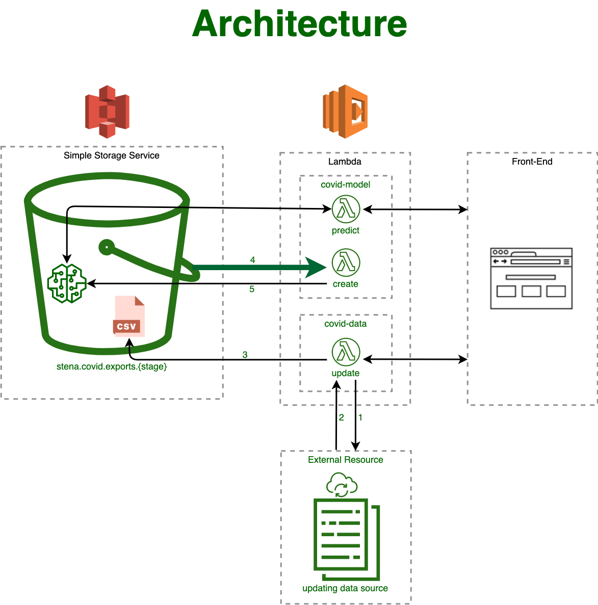

# COVID-19 Analysis in Serverless



## Modeling COVID-19 Patients Growth

This repository aims to present a simple serverless application with the intention of utilizing serverless architecture for the benefit of data science in terms of model-serving and separation of concerns.
In order to simulate data-retrieval from external resources, intricacies of Lambda-S3 interactions and model-serving, this application purposefully defines two endpoints (functions) as well as an auto-triggered function in separated sub-projects.

## Main Project (No Serverless)

The main project is the one data scientists usually start working on which consists on one or more modules to fulfill the purpose.

### Installation

```bash
git clone git@github.com:StenaTransformations/covid19.git
cd covid19
virtualenv -p python3 _venv
source _venv/bin/activate
pip3 install -r requirements.txt
streamlit run main.py
```

## Serverless Application

The serverless application provides the same functionality over AWS Lambda & S3.

### Endpoints

Through the serverless application 2 endpoints are exposed:

- Enforcing Update from External Resource
  - Will fetch updated information and will write updated csv to S3
- Prediction of Patients Growth
  - Using the number of days from now (as a GET parameter 'days')

### Auto-Trigger Function

There is model creation function that is automatically triggered when the csv from the external resource is updated and will re-create/update the existing model.

### Installation

Note: Before proceed, have the docker service running in the background.

```bash
# install Serverless globally
npm install -g serverless

# deploys to dev stage

cd covid-data
npm install
sls deploy

cd covid-model
npm install
sls deploy && sls s3deploy
```

### Execution

After deployment, the Serverless framework with log the exosed endpoints. Accordingly, Use a REST-Client or the curl command to create corresponding GET requests for both endpoints. remember to pass 'days' parameter for prediction url ([URL]?days=3)
